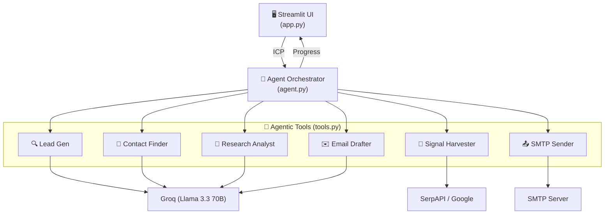

# FireReach V2 – Architecture & Documentation

> **Autonomous AI Outreach Agent**  
> Lead Generation → Signal Harvesting → Contact Discovery → Research Analysis → Email Drafting → Automated Outreach

---

## Overview

FireReach V2 is an end-to-end agentic pipeline designed to automate high-quality B2B outreach. Unlike simple sequence-to-sequence scripts, this system uses an orchestrator to manage a multi-step workflow where each step informs the next.

1. **Lead Generation**: Discovers target companies based on an Ideal Customer Profile (ICP).
2. **Signal Harvesting**: Scrapes the web for recent business triggers (funding, hiring, etc.).
3. **Contact Discovery**: Identifies the most relevant decision-maker for the target company.
4. **Research Analysis**: Synthesizes signals into a strategic account brief.
5. **Email Drafting**: Writes a hyper-personalized cold email referencing specific signals.
6. **Automated Outreach**: Sends the email via SMTP (with optional human review).

---

## Architecture



---

## File Structure

| File | Purpose |
|------|---------|
| `app.py` | Streamlit interface — inputs, progress tracking, and lead review. |
| `agent.py` | Pipeline orchestrator — manages the sequential execution of tools. |
| `tools.py` | Implementation of the 6 core agentic tools. |
| `database.py` | SQLite persistence for leads, signals, and outreach status. |
| `email_service.py` | SMTP wrapper for reliable email delivery. |
| `prompts.py` | Managed system prompts for various LLM stages. |
| `requirements.txt` | Python dependencies. |
| `.env.example` | Template for environment variables. |

---

## Tool Schemas

### 1. `tool_lead_generator(icp)`
Generates a list of target companies (Name, Domain, Reason) matching the user's ICP using the LLM.

### 2. `tool_signal_harvester(company_name)`
Collects real-world business signals (funding, hiring, tech stack) via SerpAPI or LLM fallback.

### 3. `tool_contact_finder(company_name, domain, icp)`
Heuristically determines the best persona to target and generates/finds their contact details.

### 4. `tool_research_analyst(signals, icp)`
Analyzes signals to create a "Strategic Account Brief" explaining *why* the product is a fit right now.

### 5. `tool_email_generator(account_brief, contact_name, icp, ...)`
Drafts a personalized, human-sounding email based on the research brief.

### 6. `tool_send_email(to, subject, body)`
Handles the final delivery of the approved email via the configured SMTP server.

---

## Environment Variables

| Variable | Required | Description |
|----------|----------|-------------|
| `GROQ_API_KEY` | **Yes** | API key for Groq (Llama 3.3). |
| `SERPAPI_KEY` | No | API key for SerpAPI; if omitted, the agent uses LLM fallback for signals. |
| `SMTP_HOST` | No* | SMTP server (e.g., smtp.gmail.com). |
| `SMTP_PORT` | No* | SMTP port (usually 587 for TLS). |
| `SMTP_USER` | No* | SMTP login username. |
| `SMTP_PASSWORD` | No* | SMTP app password. |

---

## Agent Workflow

```
[ User defines ICP ]
        │
        ▼
[ 1. Lead Generation ] ───────▶ [ 2. Signal Harvesting ]
                                         │
                                         ▼
[ 4. Strategic Brief ] ◀─────── [ 3. Contact Discovery ]
        │
        ▼
[ 5. Email Drafting ] ───────▶ [ 6. Delivery (SMTP) ]
```

