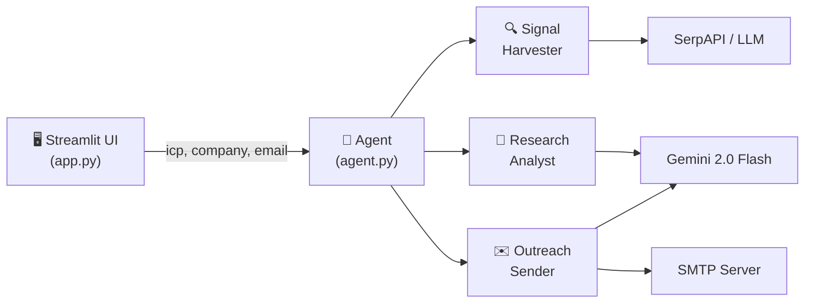

# FireReach – Architecture & Documentation

> **Autonomous AI Outreach Agent**  
> Signal Harvesting → Research Analysis → Automated Outreach

---

## Overview

FireReach is a lightweight, three-step agentic pipeline that:

1. **Harvests company signals** from the web (funding, hiring, leadership, tech stack, social mentions).
2. **Analyzes those signals** against your Ideal Customer Profile (ICP) to produce a concise account brief.
3. **Generates and sends** a hyper-personalized outreach email referencing the discovered signals.

The agent calls exactly **three tools** in strict sequential order — no steps are skipped.

---

## Architecture



---

## File Structure

| File | Purpose |
|------|---------|
| `app.py` | Streamlit interface — inputs, progress, results |
| `agent.py` | Sequential orchestrator — calls the 3 tools in order |
| `tools.py` | Implementation of the three agentic tools |
| `email_service.py` | Thin SMTP wrapper with env-var configuration |
| `prompts.py` | System prompts for the LLM (analyst & email writer) |
| `requirements.txt` | Python dependencies |
| `.env.example` | Template for environment variables |

---

## Tool Schemas

### 1. `tool_signal_harvester(company_name)`

| Field | Detail |
|-------|--------|
| **Input** | `company_name: str` |
| **Output** | `dict` with keys: `funding_rounds`, `hiring_trends`, `leadership_changes`, `tech_stack_changes`, `social_media_mentions` — each mapping to a `list[str]` |
| **Data source** | SerpAPI Google Search (when `SERPAPI_KEY` is set) **or** Gemini LLM fallback |

### 2. `tool_research_analyst(signals, icp)`

| Field | Detail |
|-------|--------|
| **Input** | `signals: dict` (from tool 1), `icp: str` |
| **Output** | `str` — two-paragraph account brief |
| **LLM** | Gemini 2.0 Flash |

### 3. `tool_outreach_automated_sender(account_brief, email, icp)`

| Field | Detail |
|-------|--------|
| **Input** | `account_brief: str` (from tool 2), `email: str`, `icp: str` |
| **Output** | `dict` with `email_subject: str`, `email_body: str`, `send_status: {"success": bool, "message": str}` |
| **LLM** | Gemini 2.0 Flash (body + subject) |
| **Email** | Python `smtplib` via `email_service.py` |

---

## Environment Variables

Create a `.env` file (see `.env.example`):

| Variable | Required | Description |
|----------|----------|-------------|
| `GEMINI_API_KEY` | **Yes** | Google Gemini API key |
| `SERPAPI_KEY` | No | SerpAPI key for real web search; omit to use LLM fallback |
| `SMTP_HOST` | No* | SMTP server hostname |
| `SMTP_PORT` | No* | SMTP port (usually 587) |
| `SMTP_USER` | No* | SMTP login username |
| `SMTP_PASSWORD` | No* | SMTP login password / app password |
| `SMTP_FROM_EMAIL` | No* | Sender "From" address |

\* SMTP vars are required only if you want emails to actually send. Without them the email is generated but not dispatched.

---

## Quick Start

```bash
# 1. Install dependencies
pip install -r requirements.txt

# 2. Copy and fill in your env vars
cp .env.example .env  # then edit .env

# 3. Run the app
streamlit run app.py
```

---

## Agent Workflow

```
User fills in ICP + Company + Email
            │
            ▼
   ┌────────────────────┐
   │  tool_signal_       │
   │  harvester          │──▶ Signals dict
   └────────────────────┘
            │
            ▼
   ┌────────────────────┐
   │  tool_research_     │
   │  analyst            │──▶ Account brief
   └────────────────────┘
            │
            ▼
   ┌────────────────────┐
   │  tool_outreach_     │
   │  automated_sender   │──▶ Email + Send status
   └────────────────────┘
            │
            ▼
   UI displays all results
```
